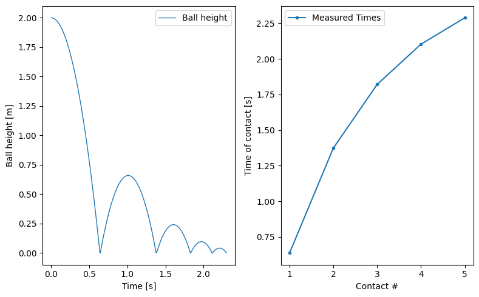
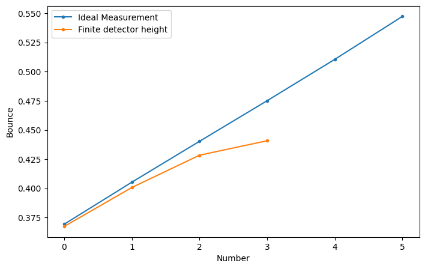
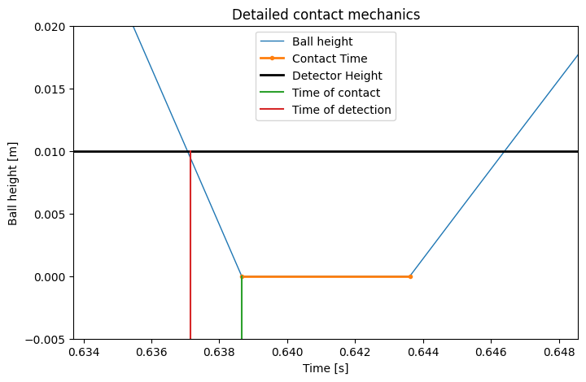
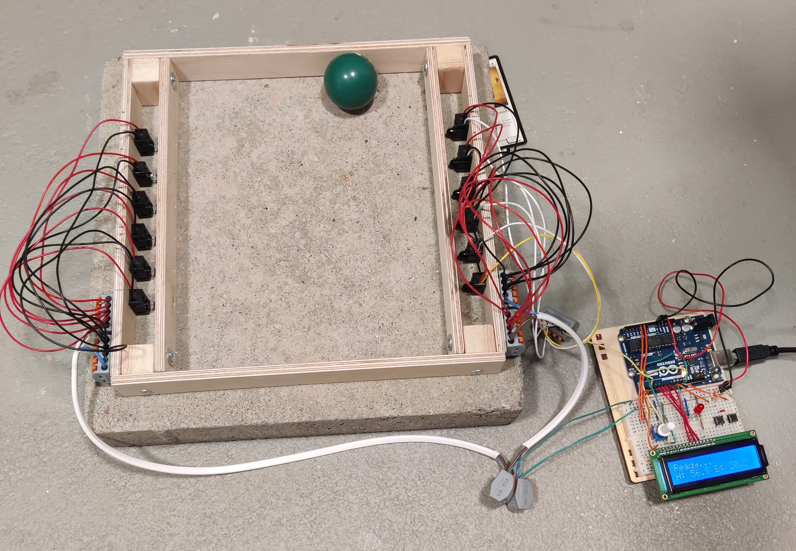
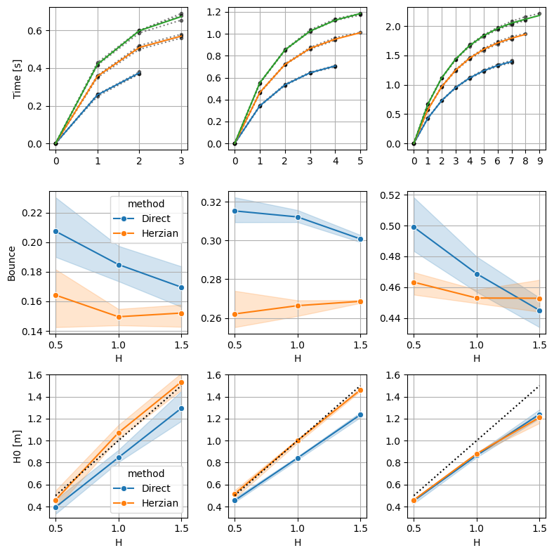
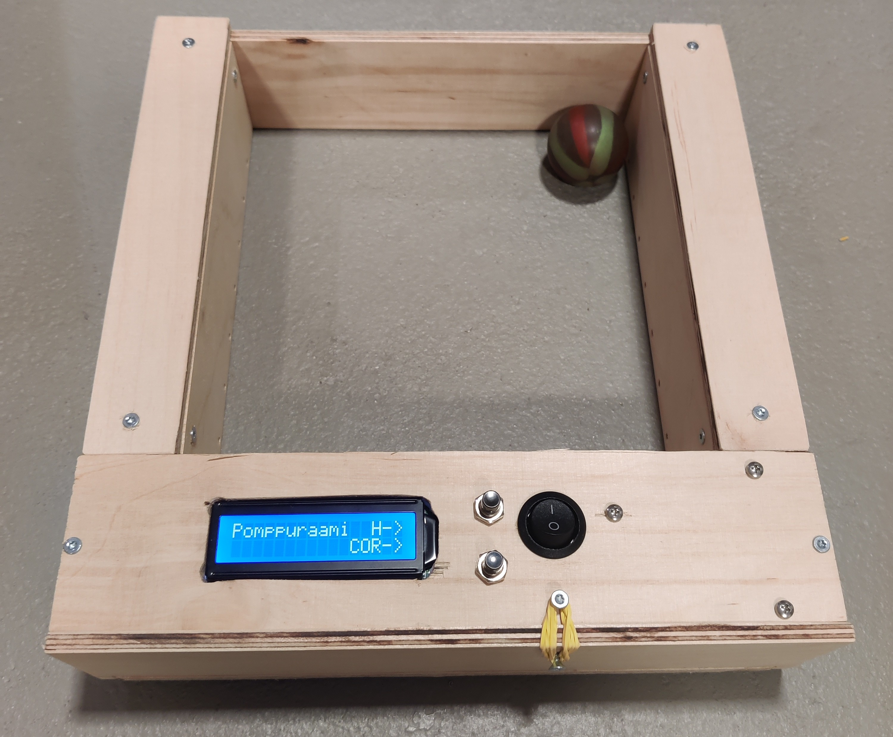

## Solving for the bounce of a minigolf ball

### Introduction

The dynamics of a vertically dropped ball has long been a seminal part of minigolf as it is a simple way to assess the viscoelastic properties of a ball. In addition to measuring the height of the bounce, e.g., the dynamic 'feel' of the bounces (how many and how frequently) is used to assess the proper conditions of the ball.

In addition to just dropping the ball and seeing how high it bounces, the simplest way to estimate the bounce is to measure the time of the first bounce $t_1$ and the time of the second bounce $t_2$ with a known starting height $h_0$. Then, we can solve for the height of the bounce

$$
h=\frac{g \Delta t ^2}{8} \, ,
$$

where $\Delta t = t_2-t_1$. The bounce of the ball is then given by $h/h_0$.

In principle, we can extend this further, by just continuing recording bounce times and solve for each successive bounce by calculating

$$
b = \frac{h_{i+1}}{h_{i}} \, .
$$

So what happens in practice...

There are two things here. First of all, for an ideal measurement, the bounce of the ball is not constant, as it is dependent on the speed of impact. As the ball slows down, the measured bounce of the ball goes up. Second, for a detector at a finite height, we can only measure a limited number of bounces, as the ball will eventually cease to rise above the detection zone after a certain amount of time. Additionally, without further corrections, the measured bounce deviates from the ideal case.

Let's dig deeper into the contact mechanics.

### Theoretical Model

When the ball hits the ground, it gets squished. This is when elastic energy is stored in the elastic deformation. When this energy is released, the ball bounces again. This contact time is not part of the flight time, so including it in the flight time will overestimate the coefficient of restitution (square root of bounce). Additionally, the detector is located at some height above the surface of the contract. This means that there is a shift between the contact and the detection, and due to velocity differences between the different bounces, this can not be modeled as a simple affine shift.

Our final model for the times is now

$$
T_i = 0.5 T_0 + \sum_{k=1}^i(T^f_k+T^c_k) -\Delta T_k \, ,
$$

where $T^f$ is the flight time, $T^c$ is the contact time, and $\Delta T$ is the detector height induced time shift. The only thing left is to formulate this in terms of the physical properties of the ball.

Fortunately, a vast amount of research has been conducted on the collisions of viscoelastic spheres, thanks to granular dynamics, so the heavy lifting is already done. For those inclined, the various works by Thorsten Pöschel et al. (conf. references) provide nice and compact equations for everything we need, but suffice it to say, the governing force is that of the interaction between viscoelastic spheres related to the particle deformation $\xi$:

$$
F(\xi,\dot{\xi})=-\rho \xi^{3/2}-\frac{3}{2}A\rho \sqrt{\xi}\dot{\xi} \, .
$$

This consists of a Hertzian elastic part, with an elastic constant $\rho(R, Y,\nu)$ and a dissipative force $A(Y,\nu,\eta)$. $Y$ and $\nu$ are the Young modulus and Poisson ratio, $R$ is the (effective) radius of the collision, and $\eta$ is material constants that relate the dissipative stress to the deformation.

This boils down to then expressing the time of contact as a function of a minimal number of unknowns, viz.: initial height $h_0$, material stiffness $K$, and a dissipation constant $\beta$

$$
\hat{T_i} = F(i,h_0, \beta, K).
$$

This can also be solved relatively cheaply for limited-memory (embedded) systems. Additionally, the stiffness $K$ has a minimal effect on the result, so in cases where we don't get many bounces, we can set $K$ to a reasonable value and only solve for two unknowns. Additionally, for numerical stability, I formulated the contact time in terms of an auxiliary variable $\propto K^ {- 1} $, as this makes the Jacobian (and Hessian) of our cost function behave more nicely.

Given this formulation and a measured set of detection times, a cost function can be formulated

$$
F = \sum (\hat{T_i}-T_i)^2 \, ,
$$

where $\hat{T_i}$ is the measured times, and minimize everything with your favorite convex optimization algorithm (I chose BFGS).

### Experimental setup

For the experimental setup, I arranged an array of infrared brake beams. Since we don't really care about the location, it's easy enough to wire everything in parallel to a single signal. The detectors are placed as close to the ground as possible.

I didn't implement any signal modulation or multiplexing for the sensors. In principle, I could have jittered or modulated the IR signals to distinguish which beam was triggered. Instead, to block spurious signals from adjacent break beams, I added pinholes in front of both the IR LEDs and the sensors to limit stray light.

As soon as any beam is broken, we record the time. I added an additional 50 ms (non-active) cooldown after each event, as it was theoretically below any possible detected signal.

In summary, we have something that appears extremely scientific and is probably not flight-safe due to overzealous airport security.

### Experimental results

Here are some calibration drops from 50 cm, 100 cm, and 150 cm. The Direct method calculates the heights for the first and the second bounce via the flight time and approximates the parameters as

$$
\text{bounce} = \frac{h_2}{h_1}
$$

$$
h_0 = \frac{h_1^2}{h_2} \, .
$$

For the Hertzian model, we minimize the loss to get the best-fit parameters for the model and use the calculated speed for a drop from 1 m to get the bounce of the ball.

What is immediately apparent here is the clear velocity dependence of the bounce. The Hertzian model does a fairly good job at measuring a property inherent to the material and less so to the experimental setup (namely, the initial height). The model performed remarkably well in determining the initial height for the two slower balls. Still, for some reason, it underestimates the height for the faster one. The exact reason here eludes me.

### Conclusions

So, what conclusions can we draw from this?

The first and foremost reason (in addition to having a good reason for some summertime tinkering) was to devise a more stable measurement system for the COR, such that there is no need for a specific initial height. The drop from a lower height produced (as predicted by physics) systematically higher COR. This is captured by the model, and the derived 1m COR stays within the standard error even when varying the initial height from 50 cm to 150 cm. In comparison to the direct approach, Hertzian modeling is more stable, and it yields a more accurate estimate for the (approximate) initial conditions.

This, of course, comes with some drawbacks. It is challenging to get all the bounces to stay within the frame. Especially for fast and hard balls, I had some trouble getting good measurements. First of all, I could invest in a better surface because the concrete slab I used was very uneven and produced noticeably inaccurate measurements. There is energy loss due to uneven surfaces. In many cases, bouncing some amount sideways causes shorter flight times. I can think of some workarounds involving repeat measures, but it is better to find an even surface.

### References

Schwager, T., & Pöschel, T. (2007). Coefficient of restitution and linear–dashpot model revisited. Granular Matter, 9(6), 465-469.

Schwager, T., & Pöschel, T. (2008). Coefficient of restitution for viscoelastic spheres: The effect of delayed recovery. Physical Review E—Statistical, Nonlinear, and Soft Matter Physics, 78(5), 051304.

Müller, P., & Pöschel, T. (2011). Collision of viscoelastic spheres: Compact expressions for the coefficient of normal restitution. Physical Review E—Statistical, Nonlinear, and Soft Matter Physics, 84(2), 021302.
